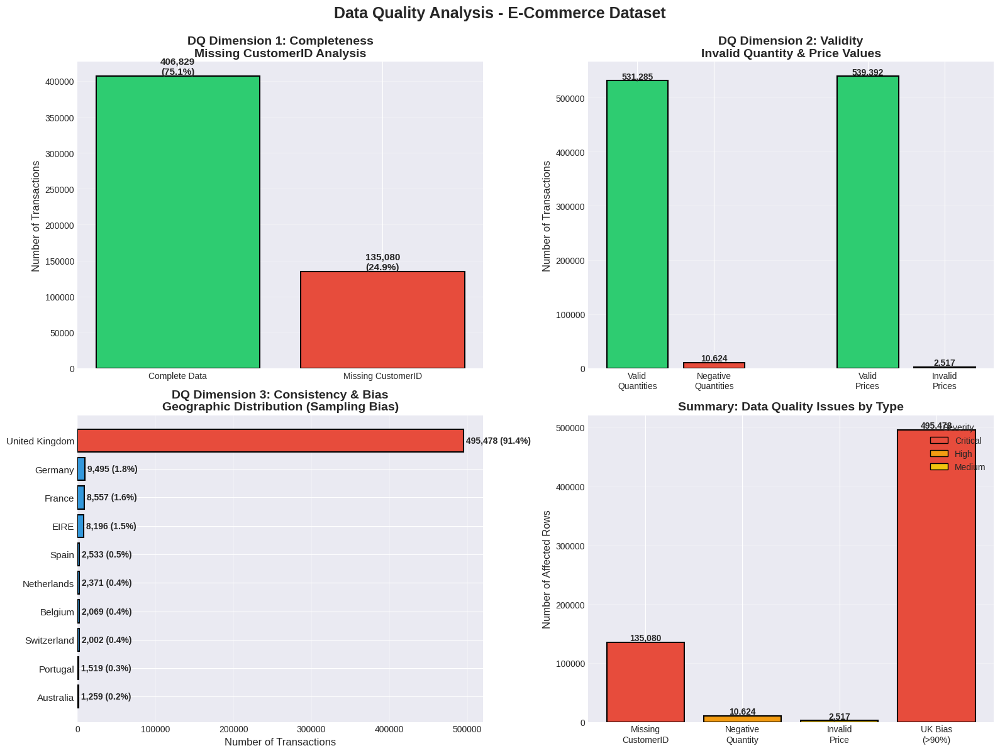

# COMP331 Data Quality Management - Final Project

**Student:** [Your Name]  
**Course:** COMP/STAT 331 - Data Quality Management  
**Semester:** Fall 2025  
**Institution:** University of the Fraser Valley

---

## 📊 Project Overview

This project analyzes data quality issues in an e-commerce retail transaction dataset containing 541,909 records. The analysis identifies critical quality problems affecting customer analytics, revenue forecasting, and machine learning model fairness.

---

## 🎯 Objectives

Apply data quality concepts from Week 10-11 lectures (Data Warehousing and Data Mining) to:
- Identify completeness, validity, and consistency issues
- Analyze impact on business intelligence and ML applications
- Propose actionable recommendations aligned with CRISP-DM framework

---

## 📁 Repository Structure
```
COMP331-Final-Project/
│
├── README.md                          # This file
├── data.xlsx                          # E-commerce transaction dataset (541K records)
├── COMP331_Analysis.ipynb             # Python analysis notebook (Google Colab)
├── data_quality_analysis.png          # Visualizations of DQ issues
└── Final_Report.pdf                   # 2-page project report (to be added)
```

---

## 🔍 Key Findings

### 1. **Completeness Issue - Missing CustomerID**
- **Problem:** 135,080 transactions (24.93%) lack CustomerID
- **Impact:** Breaks customer segmentation, RFM analysis, recommendation systems
- **Root Cause:** Guest checkout not properly tracked

### 2. **Validity Issue - Invalid Values**
- **Problem:** 10,624 negative quantities; 2,517 invalid prices
- **Impact:** Revenue calculations incorrect; ML models learn wrong patterns
- **Root Cause:** Returns not flagged separately from sales

### 3. **Consistency & Bias Issue - Geographic Concentration**
- **Problem:** 91.4% of transactions from United Kingdom only
- **Impact:** ML models biased toward UK customer behavior; unfair recommendations
- **Root Cause:** Sampling bias in data collection

---

## 🛠️ Technologies Used

- **Python 3.12**
- **Libraries:** pandas, numpy, matplotlib, seaborn
- **Environment:** Google Colab
- **Dataset:** E-commerce Online Retail Data (UCI-inspired)

---

## 📈 Data Quality Dimensions Analyzed

| Dimension | Issue Found | Severity |
|-----------|-------------|----------|
| **Completeness** | 25% missing CustomerID | 🔴 Critical |
| **Validity** | Negative quantities/prices | 🟠 High |
| **Consistency** | Geographic bias (91% UK) | 🔴 Critical |

---

## 💡 Recommendations (Prioritized)

1. **P0 - Immediate:** Implement CustomerID completeness strategy
2. **P0 - Immediate:** Standardize returns processing (flag vs. negative values)
3. **P0 - Immediate:** Mitigate geographic bias through stratified sampling
4. **P1 - 3 months:** Deploy automated DQ monitoring dashboard
5. **P1 - 3 months:** Establish data governance framework

---

## 🎓 Course Connections

### Week 10 - Data Warehousing
- ETL quality checks in Transform phase
- Referential integrity (missing foreign keys break star schema)
- Slowly Changing Dimensions for customer tracking

### Week 11 - Data Mining & Ethics
- CRISP-DM: 50% effort on Data Preparation (validated!)
- Bias detection and fairness in ML models
- Feature engineering (transform negative values into categorical)

---

## 📊 Visualizations



*Four-panel visualization showing completeness, validity, geographic bias, and issue summary.*

---

## 🚀 How to Run the Analysis

### Option 1: Google Colab (Recommended)
1. Click on `COMP331_Analysis.ipynb`
2. Click "Open in Colab" button
3. Upload `data.xlsx` when prompted
4. Run all cells (Runtime → Run all)

### Option 2: Local Jupyter Notebook
```bash
# Install dependencies
pip install pandas numpy matplotlib seaborn openpyxl

# Launch Jupyter
jupyter notebook

# Open COMP331_Analysis.ipynb
# Update file path to your data.xlsx location
```

---

## 📚 References

1. Daneshpajouh, A. (2025). Week 10-11: Data Quality in Data Warehousing. COMP 331, UFV.
2. Chapman, P., et al. (2000). CRISP-DM 1.0: Step-by-step data mining guide.
3. Kimball, R., & Ross, M. (2013). The Data Warehouse Toolkit (3rd ed.). Wiley.
4. Mehrabi, N., et al. (2021). A Survey on Bias and Fairness in Machine Learning. ACM Computing Surveys.

---

## 📧 Contact

**Student:** Ankita Bhandari  
**Email:**  Ankita.Bhandari@student.ufv.ca
**Project Date:** December 2025

---

## 📄 License

This project is submitted as academic coursework for COMP/STAT 331 at University of the Fraser Valley.
